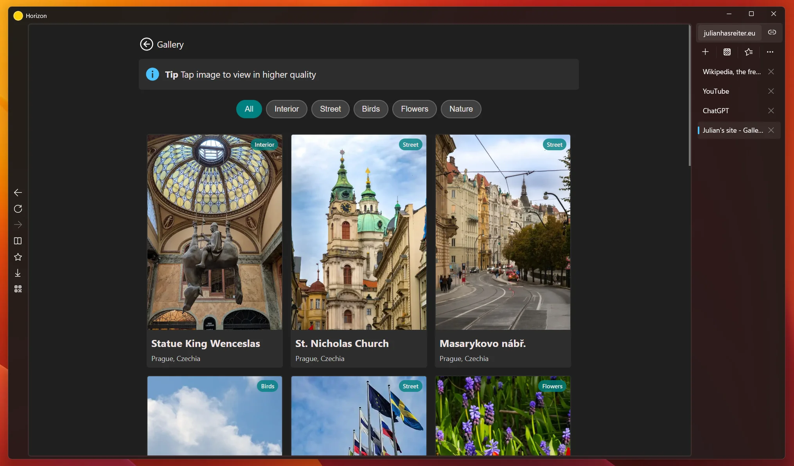

<p align="center">
  
</p>

<p align="center">
  <a href="https://apps.microsoft.com/detail/9pfs0vxcd5sr" target="_blank">
    <picture>
      <source media="(prefers-color-scheme: light)" srcset="./.github/assets/StoreBadge-dark.webp" width="220" />
      
  </picture></a>
  <a href="https://github.com/horizon-developers/browser/releases">
    </a>
</p>

Horizon is a modern webbrowser which enhances your browsing experience. It has been in active development for a few years, and is being constantly updated with bug fixes, performance improvements and new features.

## Headline features:
- Responsive UI and quick startup time
- Integrates nicely with other native Windows apps 
- Split tabs
- Reading mode
- Translate websites
- Windows Hello integration
- Generate QRCode for website

Check the app out to see them in action! 

## Installing

You can get Horizon from the main sources:

### Microsoft Store (recommended)

This is the recommended source for most users, you can get Horizon easily [here](https://apps.microsoft.com/detail/9pfs0vxcd5sr)

### Winget

If you prefer installing your apps from the command line, you can do so via winget

```batch
winget install HorizonBrowser
```

### GitHub releases (advanced)

> [!WARNING]
> You might not receive updates if you install Horizon this way, thus this method is only recommended for advanced users

If you like to get the msix for yourself and install without winget or Microsoft Store, you can get the package [here](https://github.com/horizon-developers/browser/releases)

You have to get the dependencies for your architecture (either X86, X64 or ARM64) as well as the main package. Then you can install them via PowerShell or App installer

```powershell
Add-AppxPackage ".\Microsoft.WindowsAppRuntime.1.7_7000.456.1632.0_arm64__8wekyb3d8bbwe.msix"
Add-AppxPackage ".\HorizonBrowser_10.0.5.0.msixbundle"
```
Be sure to replace them with the names of your packages according to your system and the latest versions
## Contributing

### Contributing source code
You would like to contribute to this project?

Awesome! Please first create an issue, so we can talk about the changes you like to implement

### Support the project by donating
You would like to support this project because you love it, but do not have the time or expertise to contribute source code?

A donation would be highly appreciated, and it helps me out a lot. Thanks :)

[PayPal](https://www.paypal.com/paypalme/julianhasreiter)

## Building from source

### 1. Prerequisites
- Git for Windows (MUST be present in PATH)
- Visual Studio 2026, version 18.1.0 or newer
- Windows 11 SDK (10.0.26100.0)
- .NET 10 SDK
- Windows Application Workload

### 2. Clone the repository
```batch
git clone https://github.com/horizon-developers/browser.git
```

### 3. Build the app
In the newly cloned folder, navigate into the src folder and open Horizon.slnx
On the top, select your configuration and platform and click on the play icon.
Now VS should start building the app and will start it shortly.

## License
GPL v3.0
